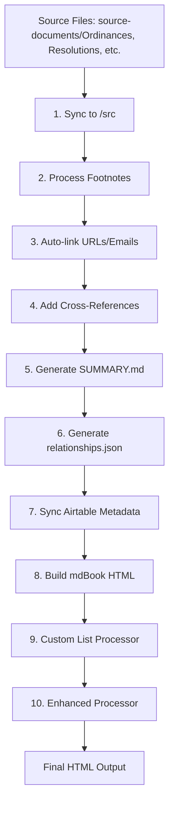

# Build System Architecture & Dependencies

## Overview

The City of Rivergrove documentation system uses a multi-stage pipeline to convert source markdown files into a beautifully formatted mdBook website with automatic cross-references, form field styling, and document-specific formatting.

## Related Documentation

- **[styles/naming-conventions.md](styles/naming-conventions.md)** - File naming standards and organization
- **[styles/signature-formatting.md](styles/signature-formatting.md)** - Signature block formatting standards
- **[styles/form-fields.md](styles/form-fields.md)** - Form field syntax and processing
- **[styles/inline-images.md](styles/inline-images.md)** - Image handling and syntax

## Processing Pipeline Order

The build process MUST follow this specific order to ensure proper processing:



### Critical Dependencies

1. **Cross-references MUST come after auto-link converter** - Prevents conflicts with URL detection
2. **Both link processors MUST come before mdBook build** - Links must be in markdown, not HTML
3. **Post-processors MUST run after mdBook** - They modify generated HTML
4. **Custom list processor MUST run before enhanced processor** - Enhanced processor depends on custom list classes

## Main Build Scripts

### Full Builds

#### `./scripts/build/update-mdbook.sh`
Standard full build with all processing steps. Use this for normal updates.

#### `./scripts/build/update-mdbook-enhanced.sh` 
Full build with enhanced document-specific formatting. Use for special document types.

#### `./scripts/build/update-mdbook-airtable.sh`
Full build with Airtable metadata integration. Use when Airtable data needs syncing.

### Partial Builds

#### `./scripts/build/update-single.sh <file>`
Quick update for a single document. Example:
```bash
./scripts/build/update-single.sh source-documents/Ordinances/1978-Ord-#28-Parks.md
```

#### `./scripts/build/build.sh`
Minimal rebuild - assumes files already in /src. Use only when source files haven't changed.

## Script Categories & Dependencies

### Preprocessing Scripts (`scripts/preprocessing/`)

These modify markdown files BEFORE mdBook processes them:

| Script | Purpose | Dependencies | When Called |
|--------|---------|--------------|-------------|
| `sync-ordinances.py` | Copy ordinances to /src, remove #, apply form fields | Source files in source-documents/Ordinances | Step 1 |
| `sync-resolutions.py` | Copy resolutions to /src, remove #, apply form fields | Source files in source-documents/Resolutions | Step 1 |
| `footnote-preprocessor.py` | Convert footnote syntax | Files in /src | Step 2 |
| `auto-link-converter.py` | Convert URLs/emails to markdown links | Files in /src | Step 3 |
| `image-processor.py` | Process inline image syntax | Files with {{image:}} tags | During sync |

### mdBook Scripts (`scripts/mdbook/`)

These prepare data for mdBook or modify markdown:

| Script | Purpose | Dependencies | When Called |
|--------|---------|--------------|-------------|
| `add-cross-references.py` | Convert document references to links | Files in /src, after auto-link | Step 4 |
| `generate-summary.py` | Create table of contents | All files in /src | Step 5 |
| `generate-relationships.py` | Build document relationship graph | All files in /src | Step 6 |
| `sync-airtable-metadata.py` | Fetch and cache Airtable data | Network access, API key | Step 7 |

### Postprocessing Scripts (`scripts/postprocessing/`)

These modify HTML AFTER mdBook generates it:

| Script | Purpose | Dependencies | When Called |
|--------|---------|--------------|-------------|
| `custom-list-processor.py` | Apply form fields, fix lists, add tooltips | HTML in /book | Step 9 |
| `enhanced-custom-processor.py` | Document-specific formatting (tables, WHEREAS) | HTML in /book, after custom-list | Step 10 |

## Form Field Processing

Form fields are processed at multiple stages. See **[styles/form-fields.md](styles/form-fields.md)** for complete syntax guide.

**Processing stages:**
1. **During sync** (`sync-ordinances.py`, etc.) - Convert to HTML spans
2. **During custom-list processing** - Apply CSS styling and tooltips

## Inline Images

Documents can include images, diagrams, and visual content. See **[styles/inline-images.md](styles/inline-images.md)** for complete syntax and usage guide.

**Processing:**
- The `{{image:}}` syntax is processed during document sync
- Images are stored in `book/images/[document-type]/` directories
- The `image-processor.py` script handles conversion to proper HTML

## Cross-Reference System

### How It Works

1. Plain text references (e.g., "Ordinance #52") are kept in source files
2. `add-cross-references.py` detects these patterns and converts to markdown links
3. Patterns detected (case-insensitive):
   - Ordinances: "Ordinance #52", "Ord. 52", "Ordinance No. 52"
   - Resolutions: "Resolution #22", "Res. #22"
   - With years: "Ordinance #70-2001", "Ordinance #54-89C"

### Important Notes

- NEVER add manual markdown links in source files
- Cross-references must run AFTER auto-link converter
- The script dynamically builds a map from all files in /src

## Common Issues & Solutions

### Issue: Cross-references not working
**Solution:** Ensure `add-cross-references.py` is called in build script and runs after auto-link converter

### Issue: Form fields disappearing
**Solution:** Run `custom-list-processor.py` after any mdBook rebuild

### Issue: Tooltips feel sluggish
**Solution:** Adjust CSS transition timing in `custom-list-processor.py`

### Issue: Roman numeral lists showing double numbering
**Solution:** Custom-list processor applies `roman-parenthetical-list` class to hide automatic numbering

## Adding New Processing Steps

When adding a new processing step:

1. Determine if it modifies markdown (preprocessing) or HTML (postprocessing)
2. Add to appropriate directory
3. Update ALL build scripts in correct order:
   - `update-mdbook.sh`
   - `update-single.sh`
   - `update-mdbook-enhanced.sh`
   - `update-mdbook-airtable.sh`
   - `build.sh` (if applicable)
4. Update this documentation

## Testing Changes

After modifying the build pipeline:

1. Test with a single file: `./scripts/build/update-single.sh [test-file]`
2. Check that all features work:
   - Form fields show blue highlighting
   - Cross-references are clickable
   - Tables have proper formatting
   - Special lists render correctly
3. Run full build: `./scripts/build/update-mdbook.sh`
4. Verify no regressions in other documents

## Performance Considerations

- `sync-*.py` scripts only copy changed files
- `add-cross-references.py` processes all files but only writes changes
- Post-processors must process all HTML files (no incremental option)
- Airtable sync can use `--if-stale` flag to skip if cache is fresh

## Future Improvements

- [ ] Incremental post-processing (only process changed HTML files)
- [ ] Parallel processing for independent steps
- [ ] Better error handling and rollback on failures
- [ ] Automated testing of processing pipeline