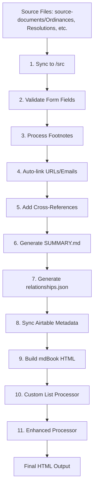

# Build System Architecture & Dependencies

## Overview

The City of Rivergrove documentation system uses a multi-stage pipeline to convert source markdown files into a beautifully formatted mdBook website with automatic cross-references, form field styling, and document-specific formatting.

## Related Documentation

- **[styles/naming-conventions.md](styles/naming-conventions.md)** - File naming standards and organization
- **[styles/signature-formatting.md](styles/signature-formatting.md)** - Signature block formatting standards
- **[styles/form-fields.md](styles/form-fields.md)** - Form field syntax and processing
- **[styles/inline-images.md](styles/inline-images.md)** - Image handling and syntax

## Processing Pipeline Order

**⚠️ CRITICAL**: Never edit files in `/src` directly! The pipeline always flows FROM source documents TO `/src`. Any direct edits to `/src` will be overwritten when sync scripts run. Always edit files in `source-documents/` or the main folders (`Ordinances/`, `Resolutions/`, etc.)

The build process MUST follow this specific order to ensure proper processing:



### Critical Dependencies

1. **Form field validation MUST run early** - Catches syntax errors before they propagate through pipeline
2. **Cross-references MUST come after auto-link converter** - Prevents conflicts with URL detection
3. **Both link processors MUST come before mdBook build** - Links must be in markdown, not HTML
4. **SUMMARY.md MUST be excluded from link processors** - Auto-link-converter and cross-reference scripts must skip SUMMARY.md to prevent mdBook parsing errors from nested markdown links
5. **Post-processors MUST run after mdBook** - They modify generated HTML
6. **Custom list processor MUST run before enhanced processor** - Enhanced processor depends on custom list classes
7. **mdBook additional files MUST be at root** - Files referenced in `book.toml` as `additional-css` or `additional-js` must exist at repository root (not in `/src`), or mdBook build will fail with "No such file or directory"
8. **Navigation JavaScript must be copied to book/** - The `navigation-standalone.js` file must be copied to the `book/` directory during builds to prevent reverting to old versions
9. **CSS is compiled BEFORE mdBook build** - CSS modules from theme/css/ are compiled into custom.css which mdBook handles natively. See [CSS Compilation Guide](css-refactor/css-compilation-guide.md) for details

## Main Build Scripts

### The Three Essential Scripts

#### `./build-all.sh [--quick]`
Complete rebuild with all processing steps in correct order.
- Automatically stops any running mdbook servers to prevent conflicts
- Runs all preprocessing, processing, and postprocessing steps
- Use `--quick` flag to skip Airtable sync for faster local testing
- Detects and warns if files in /src were manually edited

#### `./build-one.sh <file>`
Smart single-file update that auto-detects document type. Example:
```bash
./build-one.sh source-documents/Ordinances/1978-Ord-#28-Parks.md
```
- Automatically determines document type from path
- Runs only necessary processing for that file
- Much simpler than old 100+ line script

#### `./dev-server.sh`
Development server with true hot-reload from source edits.
- Watches `source-documents/` for changes (where you actually edit)
- Automatically runs full processing pipeline on save
- Applies postprocessors to maintain custom formatting
- Replaces direct `mdbook serve` usage (which breaks CSS and formatting)
- Compiles CSS and runs all postprocessors automatically

## Title Resolution System

### Unified Title Resolver (`scripts/utils/title_resolver.py`)

**Status**: ⚠️ Partially Implemented (see [Issue #22](https://github.com/wifelette/city_of_rivergrove/issues/22) for rollout status)

The title resolver provides a single source of truth for document titles across all scripts, implementing a clear hierarchy:

1. **Airtable short_title** (highest priority) - Human-curated short titles
2. **Airtable display_name** (extracted) - Falls back to display name with prefix removed
3. **Document front matter** - YAML front matter title field
4. **First H1 heading** - First # heading in document
5. **Filename extraction** (lowest priority) - Topic extracted from filename

**Current Implementation**:
- ✅ **Completed**: `generate-summary-with-airtable.py` (commit: eea45b9)
- ⏳ **In Progress**: Migration of remaining scripts tracked in Issue #22

**Scripts Pending Migration** (High Priority):
- `scripts/preprocessing/sync-ordinances.py`
- `scripts/preprocessing/sync-resolutions.py`
- `scripts/preprocessing/sync-interpretations.py`

**Scripts Pending Migration** (Medium Priority):
- `scripts/mdbook/generate-summary.py` (non-Airtable version)
- `scripts/utilities/identify-missing-metadata.py`

**Usage**:
```python
from utils.title_resolver import TitleResolver

resolver = TitleResolver()
title, source = resolver.resolve_title(filepath)
# source tells you where the title came from for debugging
```

**Note**: Until all scripts are migrated, some title inconsistencies may occur. Check Issue #22 for latest status.

## Script Categories & Dependencies

### Preprocessing Scripts (`scripts/preprocessing/`)

These modify markdown files BEFORE mdBook processes them:

| Script | Purpose | Dependencies | When Called |
|--------|---------|--------------|-------------|
| `sync-ordinances.py` | Copy ordinances to /src, remove #, apply form fields | Source files in source-documents/Ordinances | Step 1 |
| `sync-resolutions.py` | Copy resolutions to /src, remove #, apply form fields | Source files in source-documents/Resolutions | Step 1 |
| `footnote-preprocessor.py` | Convert footnote syntax | Files in /src | Step 3 |
| `auto-link-converter.py` | Convert URLs/emails to markdown links | Files in /src | Step 4 |
| ~~`image-processor.py`~~ | ~~Process inline image syntax~~ | ~~Not currently used~~ | ~~Image processing is handled by sync scripts~~ |

### Validation Scripts (`scripts/validation/`)

These ensure document syntax is correct:

| Script | Purpose | Dependencies | When Called |
|--------|---------|--------------|-------------|
| `validate-form-fields.py` | Check {{filled:}} tag syntax | Source markdown files | Step 2 |

### mdBook Scripts (`scripts/mdbook/`)

These prepare data for mdBook or modify markdown:

| Script | Purpose | Dependencies | When Called |
|--------|---------|--------------|-------------|
| `add-cross-references.py` | Convert document references to links | Files in /src, after auto-link | Step 5 |
| `generate-summary.py` | Create table of contents | All files in /src | Step 6 |
| `generate-relationships.py` | Build document relationship graph | All files in /src | Step 7 |
| `sync-airtable-metadata.py` | Fetch and cache Airtable data | Network access, API key | Step 8 |

### Postprocessing Scripts (`scripts/postprocessing/`)

These modify HTML AFTER mdBook generates it:

| Script | Purpose | Dependencies | When Called |
|--------|---------|--------------|-------------|
| `custom-list-processor.py` | Apply form fields, fix lists, add tooltips | HTML in /book | Step 10 |
| `enhanced-custom-processor.py` | Document-specific formatting (tables, WHEREAS) | HTML in /book, after custom-list | Step 11 |

## Form Field Processing

Form fields are processed at multiple stages. See **[styles/form-fields.md](styles/form-fields.md)** for complete syntax guide.

**Processing stages:**
1. **During sync** (`sync-ordinances.py`, etc.) - Convert to HTML spans
2. **During custom-list processing** - Apply CSS styling and tooltips

## Inline Images

Documents can include images, diagrams, and visual content. See **[styles/inline-images.md](styles/inline-images.md)** for complete syntax and usage guide.

**Processing:**
- The `{{image:}}` syntax is processed during document sync by the sync scripts
- Images are stored in the root `images/[document-type]/` directories (not in `src/` which is gitignored)
- Build scripts copy `images/` to `book/images/` during deployment
- The sync scripts convert `{{image:}}` tags to proper HTML figure elements

## Cross-Reference System

### How It Works

1. Plain text references (e.g., "Ordinance #52") are kept in source files
2. `add-cross-references.py` detects these patterns and converts to markdown links
3. Patterns detected (case-insensitive):
   - Ordinances: "Ordinance #52", "Ord. 52", "Ordinance No. 52"
   - Resolutions: "Resolution #22", "Res. #22"
   - With years: "Ordinance #70-2001", "Ordinance #54-89C"

### Important Notes

- NEVER add manual markdown links in source files
- Cross-references must run AFTER auto-link converter
- The script dynamically builds a map from all files in /src

## Common Issues & Solutions

### Issue: Cross-references not working
**Solution:** Ensure `add-cross-references.py` is called in build script and runs after auto-link converter

### Issue: Form fields disappearing during mdBook serve
**Problem:** mdBook's auto-rebuild bypasses our custom processors
**Solutions:**
1. **Required:** Use `./dev-server.sh` instead of `mdbook serve`
   - Compiles CSS and runs all processors automatically
   - Safeguards prevent accidental mdbook serve usage
2. **If styles are missing:** Run `./scripts/fix-styles.sh`

### Issue: Tooltips feel sluggish
**Solution:** Adjust CSS transition timing in `custom-list-processor.py`

### Issue: Roman numeral lists showing double numbering
**Solution:** Custom-list processor applies `roman-parenthetical-list` class to hide automatic numbering

## Adding New Processing Steps

When adding a new processing step:

1. Determine if it modifies markdown (preprocessing) or HTML (postprocessing)
2. Add to appropriate directory
3. Update the THREE build scripts in correct order:
   - `build-all.sh` - Add to the main pipeline
   - `build-one.sh` - Add to single-file processing if applicable
   - `dev-server.sh` - Add to the `process_file_change()` function
4. Update this documentation

## Development Server Options

### Development Server (Required)
```bash
./dev-server.sh
```
- Compiles CSS from modular files
- Starts mdbook server on port 3000  
- Runs all postprocessors automatically
- Watches for changes and rebuilds correctly

**WARNING**: Never use `mdbook serve` directly! We have safeguards to prevent this:
- `./mdbook` wrapper redirects to dev-server.sh
- Git hooks block commits if mdbook serve is running
- See [Safeguards Guide](safeguards-guide.md) for details

**Note**: For most development work, use `./dev-server.sh` instead, which provides true hot-reload from source document edits.

### Postprocess Watcher (standalone)
```bash
python3 scripts/mdbook/mdbook-postprocess-watcher.py
```
- Monitors book/ directory for HTML changes
- Detects mdBook rebuilds using file hashes
- Runs all postprocessors automatically
- Automatically stops any conflicting servers

## Testing Changes

After modifying the build pipeline:

1. Test with a single file: `./build-one.sh [test-file]`
2. Check that all features work:
   - Form fields show blue highlighting
   - Cross-references are clickable
   - Tables have proper formatting
   - Special lists render correctly
3. Run full build: `./build-all.sh`
4. Test hot-reload: `./dev-server.sh` and edit a source file
5. Verify no regressions in other documents

## Performance Considerations

- `sync-*.py` scripts only copy changed files
- `add-cross-references.py` processes all files but only writes changes
- Post-processors must process all HTML files (no incremental option)
- Airtable sync can use `--if-stale` flag to skip if cache is fresh

## Future Improvements

- [ ] Incremental post-processing (only process changed HTML files)
- [ ] Parallel processing for independent steps
- [ ] Better error handling and rollback on failures
- [ ] Automated testing of processing pipeline