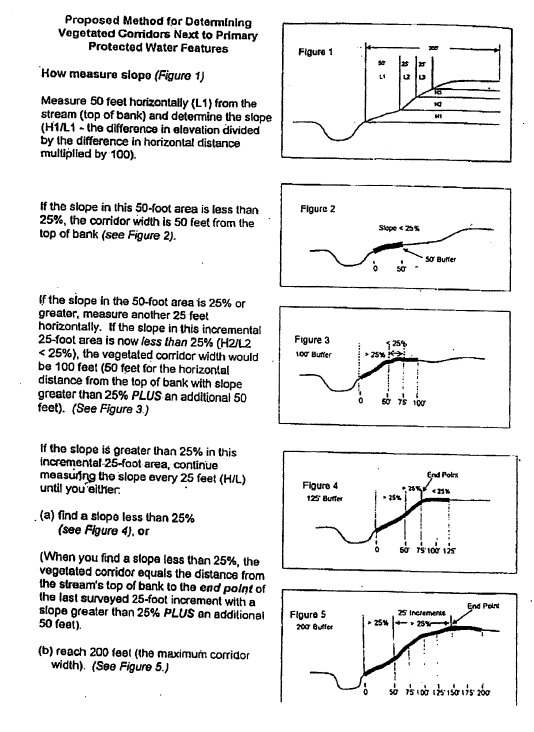

# ORDINANCE # 70-2001

**AN ORDINANCE ADOPTING AMENDMENTS TO THE RIVERGROVE LAND DEVELOPMENT AND FLOOD DAMAGE PREVENTION ORDINANCES AND THE RIVERGROVE COMPREHENSIVE PLAN IN ORDER TO COMPLY WITH THE REQUIREMENTS OF METRO'S URBAN GROWTH MANAGEMENT FUNCTIONAL PLAN.**

Planning Commission Public Hearings: 08/10/2000, 09/07/2000, 09/11/2000, 09/28/2000

City Council Public Hearings: 10/16/2000

Adopted by Rivergrove City Council: 12/10/2001

[Signature], Larry Barrett, Mayor  
**Date**: 12-10-01

**Attest:**

[Signature], Mike Collmeyer, City Recorder  
**Date**: 12/10/01

---

## Index

**Section I.** Intent  
**Section II.** Applicability  
**Section III.** Administration  
**Section IV.** Water Quality Resource Areas  
**Section V.** Flood Management Areas  
**Section VI.** Subdivisions and Partitions  
**Section VII.** Erosion Prevention and Sediment Control  
**Section VIII.** Variances  
**Section IX.** Map Administration  
**Section X.** Consistency  
**Section XI.** Warning and Disclaimer of Liability  
**Section XII.** Severability and Interpretation  
**Section XIII.** Enforcement  
**Section XIV.** Definitions  
**Appendix A** Map Presently on File with METRO  
**Appendix B** Slope Measurement  
**Appendix C** Rivergrove Native Plant List

---

# ORDINANCE # 70-2001

**AN ORDINANCE ADOPTING AMENDMENTS TO THE RIVERGROVE LAND DEVELOPMENT AND FLOOD DAMAGE PREVENTION ORDINANCES AND THE RIVERGROVE COMPREHENSIVE PLAN IN ORDER TO COMPLY WITH THE REQUIREMENTS OF METRO'S URBAN GROWTH MANAGEMENT FUNCTIONAL PLAN.**

## Statutory Authorization

The legislature of the State of Oregon has delegated the responsibility to local governmental units to adopt regulations designed to promote public health, safety and general welfare of its citizenry. **Therefore, the City of Rivergrove ordains as follows:**

## Water Quality and Flood Management Area Ordinance

### Section I. Intent

The purpose of this ordinance is:

**A.** To protect and improve water quality, to support the designated beneficial water uses and to protect the functions and values of existing and newly established Water Quality Resource Areas, by:

1. Providing and improving the vegetated corridor separating Protected Water Features from development;
2. Maintaining or reducing stream temperatures;
3. Maintaining natural stream corridors;
4. Minimizing erosion, nutrient and pollutant loading into water;
5. Providing filtration, infiltration and natural water purification; and
6. Stabilizing slopes to prevent landslides contributing to the sedimentation of protected water features.

**B.** To protect and maintain Flood Management Areas, which provide for:

1. Protection of life and property from dangers associated with flooding;
2. The storage and conveyance of stream flows through existing and natural conveyance systems, flood storage, reduction of flood velocities, reduction of flood peak flows and reduction of wind and wave impacts;
3. Maintenance of water quality by reducing and sorting sediment loads, processing chemical and organic wastes and reducing nutrients;
4. Recharging, storage and discharging of groundwater; and
5. Plant and animal habitat, and the support of riparian ecosystems.

**C.** To establish overlay zones, Water Quality Resource Areas and Flood Management Areas, which operate contemporaneously with base zones and implement the performance standards found herein.

### Section II. Applicability

**A.** This ordinance applies to:

1. Development in Water Quality Resource Areas and Flood Management Areas.
2. Development that may cause visible or measurable erosion on any property within the City of Rivergrove.

**B.** This ordinance does not apply to work necessary to protect, repair, maintain, or replace existing structures, utility facilities, roadways, driveways, accessory uses and exterior improvements in response to emergencies provided that after the emergency has passed, adverse impacts are mitigated in accordance with Table 2 standards for restoring marginal existing vegetated corridors.

**Note:** Prior to doing any emergency work in a Water Quality Resource Area it is advisable to check with other regulatory agencies, including but not limited to, the U. S. Army Corp of Engineers, the National Marine Fishery Service, the Oregon Division of State Lands, Oregon Fish & Wildlife Department, the Oregon Department of Environmental Quality and Clackamas County.

### Section III. Administration

**A.** The provisions of this ordinance shall be applied as follows:

1. The text provisions of this ordinance, including the definitions, shall determine whether an application for development is subject to the requirements of this ordinance.
2. Existing map information on file with the City shall be used as a reference to identify areas within a Water Quality Resource Area or Flood Management Area.
3. Applications shall include a delineation of any Water Quality Resource Areas and Flood Management Areas on the subject property.
4. The map information provided shall be interpreted by the City to define and refine the exact location of the boundaries of Water Quality Resource Areas and Flood Management Areas.

**B.** A development permit shall be obtained before development begins within any Water Quality Resource Area and/or Flood Management Area.

**C.** The Planning Commission is hereby appointed to administer and implement this ordinance. Duties of the Planning Commission shall include, but not be limited to:

1. Permit review including:
   - **a.** Review of all development permit applications to determine that the requirements of this ordinance have been satisfied;
   - **b.** Review all development permit applications to determine that all necessary permits have been obtained from those Federal, State, or local governmental agencies from which prior approval is required;
2. Review and maintenance of:
   - **a.** Information accepted by the Planning Commission as delineating Protected Water Features, Water Quality Resource Areas and Flood Management Areas;
   - **b.** Information showing the actual elevation of the lowest floor of all new or substantially improved structures, and whether or not the structure contains a basement;
3. Interpretation of this ordinance.

### Section IV. Water Quality Resource Areas

**A.** This ordinance establishes a Water Quality Resource Area Overlay Zone.

**B.** The Water Quality Resource Area is the vegetated corridor and the Protected Water Feature. The width of the vegetated corridor is specified in the Table One. At least three slope measurements along the water feature, at no more than 100-foot increments, shall be made for each property for which development is proposed. Depending on the width of the property, the width of the vegetated corridor will vary.

#### Table 1

| **Protected Water Feature Type**        | **Slope Adjacent to Protected Water Feature** | **Starting Point for Measurements from Water Feature**                           | **Width of Vegetated Corridor**                                                                     |
| --------------------------------------- | --------------------------------------------- | -------------------------------------------------------------------------------- | --------------------------------------------------------------------------------------------------- |
| **Primary Protected Water Features¹**   | < 25%                                         | • Edge of bankful stage or 2-year storm level; • Delineated edge of wetland | 50 feet                                                                                             |
| **Primary Protected Water Features¹**   | >25% for 150 feet or more⁵                    | • Edge of bankful stage or 2-year storm level; • Delineated edge of wetland | 200 feet                                                                                            |
| **Primary Protected Water Features¹**   | >25% for less than 150 feet⁵                  | • Edge of bankful stage or 2-year storm level; • Delineated edge of wetland | Distance from starting point of measurement to top of ravine (break in >25% slope)³, plus 50 feet.⁴ |
| **Secondary Protected Water Features²** | < 25%                                         | • Edge of bankful stage or 2-year storm level; • Delineated edge of wetland | 15 feet                                                                                             |
| **Secondary Protected Water Features²** | > 25%                                         | • Edge of bankful stage or 2-year storm level; • Delineated edge of wetland | 50 feet                                                                                             |

¹ **Primary Protected Water Features.** See definition of Protected Water Feature.  
² **Secondary Protected Water Features.** See definition of Protected Water Feature.  
³ Where the _Protected Water Feature_ is confined by a ravine or gully, the top of ravine is the break in the > 25% slope (see slope measurement in Appendix).  
⁴ A maximum reduction of 25 feet may be permitted in the width of _vegetated corridor_ beyond the slope break if a geotechnical report demonstrates that slope is stable. To establish the width of the _vegetated corridor_, slope should be measured in 25-foot increments away from the water feature until slope is less than 25% (top of ravine).  
⁵ _Vegetated corridors_ in excess of 50-feet for primary protected features, or in excess of 15-feet for secondary protected features apply on steep slopes only in the uphill direction from the _Protected Water Feature_.
⁶ Suggested method to determine two year recurrent flood elevations: obtain two year recurrent flood elevations from City of Tualatin at the Railroad Bridge Flood Gate, or, preferably, from the Lake Corp., at the head gate of the channel for Lake Oswego Canal, and extrapolate using FEMA flood-plain elevations.

**C.** Uses Permitted Outright

1. Stream, wetland, riparian and upland enhancement or restoration projects; farming practices as defined in ORS 30.930 and farm uses, excluding buildings and structures, as defined in ORS 215.203.
2. Placement of structures that do not require a grading or building permit.
3. Routine repair and maintenance of existing structures, roadways, driveways, utility facilities, accessory uses and other development.
4. Repair, replacement or improvement of utility facilities where:
   - **a.** The disturbed portion of the Water Quality Resource Area is restored; and
   - **b.** Non-native vegetation is removed from the disturbed portion of the Water Quality Resource Area and replaced with vegetation from the Rivergrove Native Plant List.
5. Additions to and/or alterations, rehabilitation, or replacement of existing structures that do not increase the existing structural footprint in the Water Quality Resource Area where:
   - **a.** The disturbed portion of the Water Quality Resource Area is restored; and
   - **b.** Non-native vegetation is removed from the disturbed portion of the Water Quality Resource Area and replaced with vegetation from the Rivergrove Native Plant List.
6. Measures to remove or abate nuisances, or any other violation of State statute, administrative agency rule or city or county ordinance where:
   - **a.** The method selected to remove or abate the nuisance or other violation will avoid or minimize adverse impacts to the Water Quality Resource Area as compared to other alternatives;
   - **b.** The disturbed portion of the Water Quality Resource Area is restored; and
   - **c.** Non-native vegetation is removed from the disturbed portion of the Water Quality Resource Area and replaced with vegetation from the Rivergrove Native Plant List.
7. New public utility facilities and stormwater pre-treatment facilities where:
   - **a.** No reasonable alternative to the requested development exists that will not disturb the Water Quality Resource Area;
   - **b.** An explanation acceptable to the City of the rationale behind choosing the alternative selected, including how adverse impacts will be avoided and/or minimized is advanced;
   - **c.** To the extent reasonable, existing vegetation shall be protected and left in place. Work areas shall be carefully located and marked to reduce potential damage to the Water Quality Resource Area. Trees in the Water Quality Resource Area shall not be used as anchors for stabilizing construction equipment;
   - **d.** The disturbed portion of the Water Quality Resource Area is restored; and
   - **e.** Non-native vegetation is removed from the disturbed portion of the Water Quality Resource Area and replaced with vegetation from the Rivergrove Native Plant List.
8. The continued maintenance and replanting of established gardens and lawns.

**D.** Conditional Uses  
The following uses are allowed in the Water Quality Resource Area Overlay Zone subject to compliance with the Application Requirements and Development Standards of subsections F and G:

1. Any use allowed in the base zone, other than those listed in subsection C above.
2. Roads and walkways to provide access to Protected Water Features or necessary ingress and egress across Water Quality Resource Areas.
3. Private utility facilities.
4. Walkways and bike paths. (Subsection G.5).
5. New private stormwater pre-treatment facilities. (Subsection G.6).
6. Widening an existing road adjacent to or running parallel to a Water Quality Resource Area.
7. Additions to and/or alterations, rehabilitation or replacement of existing structures, roadways, accessory uses and development that increase the structural footprint within the Water Quality Resource Area consistent with Subsection G.7.

**E.** Prohibited Uses

1. Any new structures and/or development, construction activities, gardens, and lawns, other than those listed in Subsection C and D; dumping of any materials of any kind.
2. Uncontained areas of hazardous materials as defined by the Department of Environmental Quality.
3. Planting of any species from the Metro Prohibited Plant List or the Metro Nuisance Plant List.

**F.** Application Requirements  
Applications for Conditional Uses in the Water Quality Resource Area Overlay Zone must provide the following information in addition to the information required for the base zone:

1. Plans drawn to scale showing the nature, location, dimensions, and elevations of the area in question, existing and proposed structures, fill, storage of materials, drainage facilities.
2. A topographic map of the site at vertical contour intervals of one foot or less showing a delineation of the Water Quality Resource Area as described in Table 1.
3. The location of all existing natural features including, but not limit to, any trees of a caliper greater than six (6) inches diameter at a height of four feet, the natural drainage on the site, and any springs or seeps therein.
4. Location of wetlands.
5. An inventory and location of existing debris and noxious materials as defined by the Department of Environmental Quality.
6. An assessment of the existing condition of the Water Quality Resource Area in accordance with Table 2.
7. An inventory of vegetation, including percentage ground and canopy coverage.
8. Alternatives analysis demonstrating that:
   - **a.** No practicable alternatives to the requested development exist that will not disturb the Water Quality Resource Area; and
   - **b.** Development in the Water Quality Resource Area has been limited to the area necessary to allow for the proposed use; and
   - **c.** The Water Quality Resource Area can be restored to an equal or better condition in accordance with Table 2; and
   - **d.** It will be consistent with any Water Quality Resource Area Mitigation Plan already in place.
   - **e.** An explanation of the rationale behind choosing the alternative selected, including how adverse impacts to resource areas will be avoided and/or minimized.
   - **f.** For applications seeking an addition to and/or alteration, rehabilitation or replacement of existing structures, roadways, accessory uses and development that will increase the structural footprint within the Water Quality Resource Area:
     1. Demonstrate that no reasonably practicable alternative design or method of development exists that would have a lesser impact on the Water Quality Resource Area than the one proposed; and
     2. If no such reasonably practicable alternative design or method of development exists, the project should be conditioned to limit its disturbance and impact on the Water Quality Resource Area to the minimum extent necessary to achieve the proposed addition, alteration, restoration, replacement or rehabilitation; and
     3. Provide mitigation to ensure that impacts to the functions and values of the Water Quality Resource Area will be mitigated or restored to the extent practicable.
9. A Water Quality Resource Area Mitigation Plan shall contain the following information:
   - **a.** A description of adverse impacts that will be caused as a result of development.
   - **b.** An explanation of how adverse impacts to resource areas will be avoided, minimized, and/or mitigated in accordance with, but not limited to, Table 2.
   - **c.** A list of all responsible parties including, but not limited to, the owner, applicant, contractor or other persons responsible for work on the development site.
   - **d.** A map showing where the specific mitigation activities will occur.
   - **e.** An implementation schedule, including timeline for construction, mitigation, mitigation maintenance, monitoring, reporting and a contingency plan. All in-stream work in fish-bearing streams shall be done in accordance with the Oregon Department of Fish and Wildlife in-stream timing schedule.
10. Other items deemed necessary and requested by the Planning Commission.

**G.** Development Standards  
Applications for Conditional Uses in the Water Quality Resource Area Overlay Zone shall satisfy the following standards:

1. The Water Quality Resource Area shall be restored and maintained in accordance with the mitigation plan and the specifications in Table 2.
2. To the extent practicable, existing vegetation shall be protected and left in place. Work areas shall be carefully located and marked to reduce potential damage to the Water Quality Resource Area. Trees in the Water Quality Resource Area shall not be used as anchors for stabilizing construction equipment.
3. Where existing vegetation has been removed, or the original land contours disturbed, the site shall be revegetated, and the vegetation shall be established as soon as practicable. Nuisance plants, as identified in the Rivergrove Native Plant List, may be removed at any time. Interim erosion control measures such as mulching shall be used to avoid erosion on bare areas. Nuisance vegetation shall be replaced with native vegetation by the next growing season.
4. Prior to construction, the Water Quality Resource Area shall be flagged, fenced or otherwise marked and shall remain undisturbed except as allowed in Subsections C and D. Such markings shall be maintained until construction is complete.
5. Public walkways, boardwalks and bike paths:
   - **a.** A walkway or bike path shall be unpaved and not be constructed closer than 10 feet from the boundary of the Protected Water Feature. Walkways and bike paths shall be constructed so as to minimize disturbance to existing vegetation. Where practicable, a maximum of 10 percent of the trail may be within 30 feet of the Protected Water Feature.
   - **b.** A walkway or bike path shall not exceed 10 feet in width.
   - **c.** A raised boardwalk may cross a Protected Water Feature if it serves the interest of the public.
6. Stormwater pre-treatment facilities:
   - **a.** The stormwater pre-treatment facility may only encroach a maximum of 25 feet into the outside boundary of the Water Quality Resource Area of a primary water feature; and
   - **b.** The area of encroachment must be replaced by adding an equal area to the Water Quality Resource Area on the subject property.
7. Additions to and/or alterations, rehabilitation and replacement of lawful structures that increase the structural footprint:
   - **a.** For existing structures, roadways, driveways, accessory uses and development which are nonconforming, this ordinance shall apply in addition to the nonconforming use regulations of the city zoning ordinance.
   - **b.** Additions, alterations, rehabilitation or replacement of existing structures, roadways, driveways, accessory uses and development shall not encroach closer to the Protected Water Feature than the existing structures, roadways, driveways, accessory uses and development.
8. Off-site Mitigation:
   - **a.** Where the alternatives analysis demonstrates that there are no practicable alternatives for mitigation on site, off-site mitigation shall be located as follows:
     1. As close to the development as is practicable above the confluence of the next downstream tributary, or if this is not practicable;
     2. Within the watershed where the development will take place or as otherwise specified by the city or county in an approved Wetland Mitigation Bank.
   - **b.** In order to ensure that the mitigation area will be protected in perpetuity, proof of placement of a conservation easement or other means preserving the restriction on the property where the mitigation is to occur is required.

---

#### Table 2

**WATER QUALITY RESOURCE AREA REQUIREMENTS**

| **EXISTING CONDITION OF WATER QUALITY RESOURCE AREA**                                                                                                                                                                                              | **SUGGESTIONS IF WATER QUALITY RESOURCE AREA REMAINS UNDISTURBED DURING CONSTRUCTION**                                                                                                                                                                                                                                 | **REQUIREMENTS IF WATER QUALITY RESOURCE AREA IS DISTURBED DURING CONSTRUCTION**                                                                                                                                                                                                                                                                                                                                                                                                                                                                                                                                                                                                                                                                                                                                                                                                                |
| -------------------------------------------------------------------------------------------------------------------------------------------------------------------------------------------------------------------------------------------------- | ---------------------------------------------------------------------------------------------------------------------------------------------------------------------------------------------------------------------------------------------------------------------------------------------------------------------- | ----------------------------------------------------------------------------------------------------------------------------------------------------------------------------------------------------------------------------------------------------------------------------------------------------------------------------------------------------------------------------------------------------------------------------------------------------------------------------------------------------------------------------------------------------------------------------------------------------------------------------------------------------------------------------------------------------------------------------------------------------------------------------------------------------------------------------------------------------------------------------------------------- |
| **Good Existing Corridor:** Combination of trees, shrubs and groundcover is 80% present, and 90% or greater of said surface coverage is native vegetation, and there is more than 50% tree canopy coverage in the vegetated corridor.              | 1. Obtain certification by a Registered professional engineer, landscape architect, or biologist or other person trained or certified in riparian or wetland delineation describing the condition of the vegetated corridor.  2. Inventory and remove debris and noxious materials.                          | 1. Obtain certification by a Registered professional engineer, landscape architect, or biologist or other person trained or certified in riparian or wetland delineation describing the condition of the vegetated corridor, specifically addressing the areas proposed to be disturbed and setting forth a plan for mitigating water quality impacts related to the development, including: sediments, temperature and nutrients, sediment control, temperature control or addressing any other condition that may have caused the Protected Water Feature to be listed on DEQ's 303 (d) list.  2. Inventory and remove debris and noxious vegetation and materials.  3. Re-vegetate disturbed areas and mitigation areas with native vegetation to restore the groundcover and canopy condition to that found in a Good Corridor pursuant to an approved mitigation plan. |
| **Marginal Existing Vegetated Corridor:** Combination of trees, shrubs and groundcover are less than 80% present, or less than 90% of said surface coverage is native vegetation, or less than 50% tree canopy coverage in the vegetated corridor. | 1 and 2 above, and  3. Vegetate bare areas with Native Vegetation to enhance groundcover and canopy condition to that found in a Good Corridor.  4. Remove non-native species and re-vegetate with Native Vegetation to enhance groundcover and canopy condition to that found in a Good Corridor. | 1 and 2 above, and  4. Re-vegetate disturbed areas and mitigation areas with native vegetation to enhance the groundcover and canopy condition to that found in a Good Corridor pursuant to an approved mitigation plan. Re-vegetation must occur during the next planting season following site disturbance. Annual replacement of plants that do not survive is required during the life of the mitigation plan. Seeding may be required prior to establishing plants for site stabilization.                                                                                                                                                                                                                                                                                                                                                                                       |
| **Degraded Existing Vegetated Corridor:** Combination of trees, shrubs and groundcover are less than 70% present, or less than 70% of said surface coverage is native vegetation, or less than 25% tree canopy coverage in the vegetated corridor. | 1, 2, 3 and 4 above, and  5. Develop a Mitigation Plan to enhance groundcover and canopy condition to that found in a Good Corridor and implement pursuant to plan.  6. All mitigation must meet the performance standards for Water Quality Resource Areas.                                       | 1, 2 and 4 above, and  5. Develop a Mitigation Plan to enhance the groundcover and canopy condition to that found in a Good Corridor and implement pursuant to plan.  6. All mitigation must meet the performance standards for Water Quality Resource Areas.                                                                                                                                                                                                                                                                                                                                                                                                                                                                                                                                                                                                               |

### Section V. Flood Management Areas

**A.** This ordinance establishes a Flood Management Area Overlay Zone. The standards set forth herein apply to the Flood Management Areas in addition to other local, state or federal restrictions governing floodplains or flood hazard areas.

**B.** Flood Management Areas include land contained within the 100-year floodplain and floodway as shown on the Federal Emergency Management Agency Flood Insurance maps.

**C.** Uses Permitted Outright:

1. Excavation and fill required to plant any new trees or vegetation.
2. Restoration or enhancement of floodplains, riparian areas, wetland, upland and streams that meet federal and state standards.

**D.** Conditional Uses:  
All uses allowed in the base zone or existing flood hazard overlay zone are allowed in the Flood Management Overlay Zone subject to compliance with the Development Standards herein.

**E.** Prohibited Uses:

1. Any use prohibited in the base zone or existing flood hazard overlay zone.
2. Uncontained areas of hazardous materials as defined by the Department of Environmental Quality.

**F.** Application Requirements  
Applications for a development permit within any Flood Management Area Overlay Zone shall include, in addition to the items specified base zone:

1. Plans drawn to scale showing the nature, location, dimensions, and elevations of the area in question, existing and proposed structures, fill, storage of materials, drainage facilities;
2. Elevation in relation to mean sea level, of the lowest floor (including basement) of all structures;
3. Elevation in relation to mean sea level to which any structure has been floodproofed;
4. Demonstration that the plans meet the floodproofing criteria herein; and
5. Demonstration of how the development will impact flood storage capacities, watercourses and their velocities.
6. Other items deemed necessary and requested by the Planning Commission.

**G.** Development Standards  
All development, excavation and fill in the floodplain shall conform to the following standards:

1. No net fill in any floodplain is allowed. All fill placed in a floodplain shall be balanced with at least an equal amount of soil material removal.
2. Excavation areas shall not exceed fill areas by more than 50 percent of the square footage.
3. Any excavation below the 10 year flood elevation for the property shall not count toward compensating for the fill.
4. Excavation to balance a fill shall be located on the same parcel as the fill unless it is not reasonable or practicable to do so. In such cases, the excavation shall be located in the same drainage basin and as close as possible to the fill site, so long as the proposed excavation and fill will not increase flood impacts for surrounding properties as determined through hydrologic and hydraulic analysis.
5. For excavated areas identified by the city or county to remain dry in the summer, such as parks or mowed areas, the lowest elevation of the excavated area shall be at least 6 inches above the winter "low water" elevation, and sloped at a minimum of two percent towards the Protected Water Feature. One percent slopes will be allowed in smaller areas.
6. For excavated areas identified by the city or county to remain wet in the summer, such as a constructed wetland, the grade shall be designed not to drain into the Protected Water Feature.
7. Minimum finished floor elevations must be at least one foot above the design flood elevation for new habitable structures in the Flood Area.
8. Short-term parking in the floodplain may be located at an elevation of no more than one foot below the ten-year floodplain so long as the parking facilities do not occur in a Water Quality Resource Area. Long-term parking in the floodplain may be located at an elevation of no more than one foot below the 100-year floodplain so long as the parking facilities do not occur in a Water Quality Resource Area.
9. Temporary fills permitted during construction shall be removed.
10. New culverts, stream crossings and transportation projects shall be designed as balanced cut and fill projects or designed not to significantly raise the design flood elevation. Such projects shall be designed to minimize the area of fill in Flood Management Areas and to minimize erosive velocities. Stream crossings shall be as close to perpendicular to the stream as practicable. Bridges shall be used instead of culverts wherever practicable.
11. Excavation and fill required for the construction of detention facilities or structures, and other facilities, such as levees, specifically shall be designed to reduce or mitigate flood impacts and improve water quality. Levees shall not be used to create vacant buildable lands.

12. Venting  
    a. Fully enclosed areas below the lowest floor that are subject to flooding are prohibited, or shall be designed to automatically equalize hydrostatic flood forces on exterior walls by allowing for the entry and exit of flood waters. Designs for meeting this requirement must either be certified by a registered professional engineer or architect or must meet or exceed the following minimum criteria:
    (i) A minimum of two openings having a total net area of not less than one square inch for every square foot of enclosed area subject to flooding shall be provided.
    (ii) The bottom of all openings shall be no higher than one foot above grade.
    (iii) Openings may be equipped with screens, louvers or other coverings or devices provided that they permit the automatic entry and exit of floodwaters.
13. Anchoring  
    a. All new construction and substantial improvements shall be anchored to prevent flotation, collapse, or lateral movement of the structure.
    b. All manufactured homes must likewise be anchored to prevent flotation, collapse or lateral movement, and shall be installed using methods and practices that minimize load damage. Anchoring methods may include, but are not limited to, use of over-the-top or frame ties to ground anchors.
14. Construction Materials and Methods  
    a. All new construction and substantial improvements lying below the 100-year flood elevation shall be constructed with materials and utility equipment resistant to flood damage.
    b. All new construction and substantial improvements shall be constructed using methods and practices that minimize flood damage.
    c. Electrical, heating, ventilation, plumbing, and air-conditioning equipment and other service facilities shall be designed and/or otherwise elevated or located so as to prevent water from entering or accumulating within the components during conditions of flooding.
15. Utilities  
    a. All new and replacement water supply systems shall be designed to minimize or eliminate infiltration of flood waters into the system;
    b. New and replacement sanitary sewage systems shall be designed to minimize or eliminate infiltration of flood waters into the systems and discharge from the system into flood waters; and,
    c. On-site waste disposal systems shall be located to avoid impairment to them or contamination from them during flooding.
16. Subdivision Proposals  
    a. All subdivision proposals shall be consistent with the need to minimize flood damage;
    b. All subdivision proposals shall have public utilities and facilities such as sewer, gas, electrical, and water systems located and constructed to minimize flood damage;
    c. All subdivision proposals shall have adequate drainage provided to reduce exposure to flood damage.

### Section VI. Subdivisions and Partitions

**A.** The purpose of this section is to amend the city regulations governing land divisions to require that new subdivision and partition plats delineate and show the Water Quality Resource Area as a separate tract.

**B.** The standards for land divisions in Water Quality Resource Areas Overlay Zone shall apply in addition to the requirements of the city land division ordinance and zoning ordinance.

**C.** Prior to preliminary plat approval, the Water Quality Resource Area shall be shown as a separate tract, which shall not be a part of any parcel used for construction of a dwelling unit.

**D.** Prior to final plat approval, ownership of the Water Quality Resource Area tract shall be identified to distinguish it from lots intended for development. The tract may be identified as any one of the following:

1. Private open space held by the owner or homeowners association; or
2. For residential land divisions, private open space subject to an easement conveying storm and surface water management rights to the county and preventing the owner of the tract from activities and uses inconsistent with the purpose of this ordinance; or
3. At the owner's option, public open space where the tract has been dedicated to the city or other governmental unit; or
4. Any other ownership proposed by the owner and approved by the City Council.

**Note:** Approval by the governmental unit of any dedication or transfer to the governmental unit is required prior to transfer.

**E.** Where the Water Quality Resource Area tract is dedicated to the city or other governmental unit, development shall be subject to a minimum 3-foot setback from the Water Quality Resource Area.

**F.** The density of development that would otherwise be permitted on an area of land contained within a Water Quality Resource Area tract that is set aside as provided above may be transferred to adjacent lots. Once density is transferred from a lot within the Water Quality Resource Area, the increase allocated to the transfer lot may not be transferred to any other lot. Density transfers shall be noted on the partition or subdivision map.

### Section VII. Erosion Prevention and Sediment Control

**A.** The purpose of this section is to require erosion prevention measures and sediment control practices for all development inside and outside the Water Quality Resource Area and Flood Management Area Overlay Zones during construction to prevent and restrict the discharge of sediments, and to require final permanent erosion prevention measures, which may include landscaping, after development is completed. Erosion prevention techniques shall be designed to protect soil particles from the force of water and wind so that they will not be transported from the site. Sediment control measures shall be designed to capture soil particles after they have become dislodged by erosion and attempt to retain the soil particles on site.

**B.** Prior to beginning work the applicant shall obtain an Erosion and Sediment Control Permit from the County.

**C.** The County may inspect the development site to determine compliance with the Erosion and Sediment Control Plan and Permit.

**D.** Erosion that occurs on a development site that does not have an Erosion and Sediment Control Permit, or that results from a failure to comply with the terms of such a Permit, constitutes a violation of this ordinance.

_Note: Sections E and F are missing from the original source document, this is not a digitization error._

**G.** If the County finds that the facilities and techniques approved in an Erosion and Sediment Control Plan and Permit are not sufficient to prevent erosion, the County shall notify the permittee. Upon receiving notice, the permittee shall immediately install interim erosion and sediment control measures as required by the County. If required by the County, the applicant shall submit and implement a revised Erosion and Sediment Control Plan.

### Section VIII. Variances

**A.** The purpose of this Section is to ensure that compliance with this ordinance does not cause unreasonable hardship. To avoid such instances, the requirements of this ordinance may be varied. Variances are also allowed when strict application of this ordinance would deprive an owner of all economically viable use of land.

**B.** This Section applies in addition to the standards governing proposals to vary the requirements of the base zone.

**C.** The Planning Commission shall, upon receiving an application to vary the requirements of this ordinance, provide notice of the request to all property owners within (200) feet.

**D.** Development may occur on lots located completely within the Water Quality Resource Area Overlay Zone that were legally created on or before the date this ordinance was adopted or on lots legally created after the adoption of this ordinance so long as the application to create the lot or lots was deemed complete prior to the adoption of this ordinance. Development shall not disturb more than 5,000 square feet of the vegetated corridor, including access roads and driveways, subject to the erosion and sediment control standards of this ordinance.

**E.** Hardship Variance  
Variances to avoid unreasonable hardship caused by the strict application of this ordinance are permitted subject to the criteria set forth in this section. To vary from the requirements of this ordinance, the applicant must demonstrate the following:

1. The variance is the minimum necessary to allow the proposed use or activity;
2. The variance does not increase danger to life and property due to flooding or erosion;
3. The impact of the increase in flood hazard, which will result from the variance, will not prevent the city or county from meeting the requirements of this ordinance. In support of this criteria the applicant shall have a qualified professional engineer document the expected height, velocity and duration of flood waters, and estimate the rate of increase in sediment transport of the flood waters expected both downstream and upstream as a result of the variance;
4. The variance will not increase the cost of providing and maintaining public services during and after flood conditions so as to unduly burden public agencies and taxpayers;
5. Unless the proposed variance is from Section IV F.9 (mitigation) or Section VII (erosion control), the proposed use will comply with those standards; and
6. The proposed use complies with the standards of the base zone.

**F.** Buildable Lot Variance  
A variance to avoid the loss of substantial economically viable use of a lot that is partially inside the Water Quality Resource Area Overlay Zone is permitted. Development on such lots shall not disturb more than 5,000 square feet of the vegetated corridor, including access roads and driveways, subject to the erosion and sediment control standards in Section VII of this ordinance. Applicants must demonstrate the following:

1. Without the proposed variance, the applicant would be denied economically viable use of the subject property. To meet this criterion, the applicant must show that:
   - **a.** The proposed use cannot meet the standards in Section VIII E (hardship variance); and
   - **b.** No other application could result in permission for an economically viable use of the subject property. Evidence to meet this criterion shall include a list of uses allowed on the subject property.
2. The proposed variance is the minimum necessary to allow for the requested use;
3. The proposed variance will comply with Section IV F.9 (mitigation) and Section VII (erosion control); and
4. The proposed use complies with the standards of the base zone.

**G.** Variance Conditions  
The Planning Commission may impose such conditions as are deemed necessary to limit any adverse impacts that may result from granting relief. If a variance is granted pursuant to Subsections E 1-6, the variance shall be subject to the following conditions:

1. The minimum width of the vegetated corridor shall be 15 feet on each side of a Primary Protected Water Feature, except as allowed in Section IV C and D;
2. No more than 25 percent of the length of the Water Quality Resource Area for a Primary Protected Water Feature within a development site can be less than 30 feet in width on each side of the water feature; and
3. In either case, the average width of the Water Quality Resource Area shall be a minimum of 15 feet on each side for Secondary Protected Water Features, a minimum of 50 feet on each side for Primary Protected Water Features, or up to 200 feet on each side in areas with slopes greater than 25 percent. The stream shall be allowed to meander within this area, but in no case shall the stream be less than 10 feet from the outer boundary of the Water Quality Resource Area.

### Section IX. Map Administration

**A.** The purpose of this section is to provide for maps designating the Protected Water Features, Water Quality Resource Areas and Flood Management Areas in the City of Rivergrove.

**B.** Copies of the maps on file which have been accepted by the city as delineating a Protected Water Feature or the Flood Management Area shall be submitted to Metro to update Metro's Water Quality Management Maps and may be used by the city as a reference.

**C.** When the city makes a finding in the processing of a new application that adds, corrects or alters the location of a Protected Water Feature, Water Quality Resource Area and/or Flood Management Area it shall retain the map for future reference and submit a copy to Metro to update Metro's Water Quality Management Maps. Areas added to Wetlands, Water Quality Resource Areas and Flood Management Areas in mitigation of uses allowed herein shall be treated as an addition or alteration of the location of a Protected Water Feature, Water Quality Resource Area and/or Flood Management Area.

### Section X. Consistency

Where the provisions of this ordinance are less restrictive or conflict with comparable provisions of the zoning ordinance, regional, state or federal law, the provisions that are more restrictive shall govern. Where this ordinance imposes restrictions that are more stringent than regional, state and federal law, the provisions of this ordinance shall govern.

### Section XI. Warning and Disclaimer of Liability

The degree of flood protection required by this ordinance is considered reasonable for regulatory purposes and is based on scientific and engineering considerations. Larger floods can and will occur on rare occasions. Flood heights may be increased by man-made or natural causes. This ordinance does not imply that land outside the areas of special flood hazards or uses permitted within such areas will be free from flooding or flood damages. This ordinance shall not create liability on the part of the City or County, any officer or employee thereof, or the Federal Insurance Administration, for any damages that result from reliance on this ordinance or any administrative decision lawfully made hereunder.

### Section XII. Severability and Interpretation

**A.** If any section, subsection, sentence, clause, phrase or word of this ordinance should be declared invalid or unconstitutional by a court of competent jurisdiction, such invalidity or unconstitutionality thereof shall not affect the validity or constitutionality of any other section, subsection, sentence, clause, phrase or word of this ordinance.

**B.** Any conflict between the text of this ordinance and any heading, caption, figure, illustration, table or map is resolved in favor of the text.

### Section XIII. Enforcement

**A.** No person shall engage in or cause to occur any development, use or activity that fails to meet the standards and requirements of this ordinance.

**B.** In addition to other powers the city or county may exercise to enforce this ordinance, the city or county may:

1. Establish a cooperative agreement between the city and the applicant (or responsible party) to remedy the violation.
2. Issue a stop work order.
3. Impose a civil penalty of not more than $500 for each violation upon the permittee, contractor or person responsible for carrying out the development work. Each day of violation shall constitute a separate offense.
4. Cause an action to be instituted in a court of competent jurisdiction.
5. Authorize summary abatement and subsequent recovery of costs incurred by the city.

### Section XIV. Definitions

Definitions. Unless specifically defined below, words or phrases used in this section shall be interpreted to give them the same meaning as they have in common usage and to give this classification its most reasonable application.

**Architect** - An architect licensed by the State of Oregon.

**Bankful Stage** - Defined in OAR 141-85-010 as the stage or elevation at which water overflows the natural banks of a stream or other waters of the state and begin to inundate upland areas. In the absence of a physically defined top of bank, the two-year recurrent flood elevation may be used to approximate the bankful stage.

**Base Zone** - The zoning for a parcel in the City of Rivergrove as established by the Comprehensive Plan and the Rivergrove Land Development Ordinance.

**Created Wetlands** - Those wetlands developed in an area previously identified as a non-wetland to replace, or mitigate wetland destruction or displacement. A created wetland shall be regulated and managed the same as an existing wetland.

**Debris** - discarded man-made objects that would not occur in an undeveloped stream corridor or wetlands. Debris includes, but is not limited to, tires, vehicles, litter, scrap metal, construction waste, lumber, plastic or styrofoam. Debris does not include objects necessary to a use allowed by this ordinance, or ornamental and recreational structures. Debris does not include existing natural plant materials or natural plant materials which are left after flooding, downed or standing dead trees or trees which have fallen into Protected Water Features.

**Department of Environmental Quality (DEQ) Water Quality Standards** - The numerical criteria or narrative condition needed in order to protect an identified beneficial use.

**Design Flood Elevation** -the elevation of the 100-year storm as defined in FEMA Flood Insurance Studies.

**Development** - any man-made change defined as buildings, the siting of manufactured homes or other structures, mining, dredging paving, filling, or grading in amounts greater than ten (10) cubic yards on any lot or excavation. In addition, any other activity that results in the removal of more than 20 percent of the vegetation in the Water Quality Resource Area on a lot is defined as development, for the purpose of this ordinance. An activity that is not development but results in the removal of vegetation in the Water Quality Resource Area on a lot must comply with the Erosion and Sediment Control measures set forth herein. Development for the purposes of this ordinance does not include the following: a) Stream enhancement or restoration projects approved by cities and counties and b) Farming practices as defined in ORS 30.930 and farm use as defined in ORS 215.203, except that buildings associated with farm practices and farm uses are subject to the requirements of this ordinance.

**Disturb** - man-made changes to the existing physical status of the land, which are made in connection with development. The following uses are excluded from the definition:

enhancement or restoration of the Water Quality Resource Area;

planting native cover identified in the Rivergrove Native Plant List.

**Emergency** - any man-made or natural event or circumstance causing or threatening loss of life, injury to person or property, and includes, but is not limited to, fire, explosion, flood, severe weather, drought earthquake, volcanic activity, spills or releases of oil or hazardous material, contamination, utility or transportation disruptions, and disease.

**Engineer** - A registered professional engineer licensed by the State of Oregon.

**Enhancement** - the process of improving upon the natural functions and/or values of an area or feature which has been degraded by human activity. Enhancement activities may or may not return the site to a pre-disturbance condition, but create/recreate processes and features that occur naturally.

**Erosion** - Erosion is the movement of soil particles resulting from actions of water or wind.

**Fill** - any material such as, but not limited to, sand, gravel, soil, rock or gravel that is placed in a wetland or floodplain for the purposes of development or redevelopment.

**Floodplain** - The land area identified and designated by the FEMA that has been or may be covered temporarily by water as a result of a storm event of identified frequency. It is usually the flat area of land adjacent to a stream or river formed by floods.

**Floodway** - The portion of a watercourse required for the passage or conveyance of a given storm event as identified and designated by FEMA. The floodway shall include the channel of the watercourse and the adjacent floodplain that must be reserved in an unobstructed condition in order to discharge the base flood without flood levels by more than one foot. **Flood Management Areas** - all lands contained within the 100-year floodplain and floodway as shown on the Federal Emergency Management Agency Flood Insurance Maps.

**Invasive Non-native or Noxious Vegetation** - plant species that have been introduced and due to aggressive growth patterns and lack of natural enemies in the area where introduced, spread rapidly into native plant communities, or which are not listed on the Rivergrove Native Plant List as adopted by Rivergrove Council resolution.

**Lot** - Lot means a single unit of land that is created by a subdivision of land. (ORS 92.010(3)).

**Metro Prohibited Plant List or Metro Nuisance Plant List** – lists of prohibited or nuisance plants for Water Quality Resource Areas as adopted by Metro Council resolution.

**Mitigation** - the reduction of adverse effects of a proposed project by considering, in the order: a) avoiding the impact all together by not taking a certain action or parts of an action; b) minimizing impacts by limiting the degree or magnitude of the action and its implementation; c) rectifying the impact by repairing, rehabilitating or restoring the affected environment; d) reducing or eliminating the impact over time by preservation and maintenance operations during the life of the action by monitoring and taking appropriate measures; and e) compensating for the impact by replacing or providing comparable substitute Water Quality Resource Areas.

**Native Vegetation** - any vegetation native to the Portland metropolitan area or listed on the Rivergrove Native Plant List as adopted by Rivergrove Council resolution.

**Open Space** - Land that is undeveloped and that is planned to remain so indefinitely. The term encompasses parks, forests and farmland. It may also refer only to land zoned as being available to the public, including playgrounds, watershed preserves and parks.

**Overlay Zone** - An area within the City of Rivergrove that lies within a Water Quality Resource Area and/or a Flood Management Area.

**Owner or Property Owner** - The person who is the legal record owner of the land, and where there is a recorded land sale contract, the purchaser thereunder.

**Parcel** - Parcel means a single unit of land that is created by a partitioning of land. (ORS 92.010(7)).

**Plans** - The drawings and designs that specify construction details.

**Practicable** - means available and capable of being done after taking into consideration cost, existing technology, and logistics in light of overall project purpose.

**Protected Water Features**  
Primary Protected Water Features shall include:

- **a.** wetlands; and
- **b.** rivers, streams, and drainages downstream from the point at which 100 acres or more are drained to that water feature (regardless of whether it carries year-round flow); and
- **c.** streams carrying year-round flow; and
- **d.** springs which feed streams and wetlands and have year-round flow and
- **e.** natural lakes.

Secondary Protected Water Features shall include intermittent streams and seeps downstream of the point at which 50 acres are drained and upstream of the point at which 100 acres are drained to that water feature.

**Restoration** - the process of returning a disturbed or altered area or feature to a previously existing natural condition. Restoration activities reestablish the structure, function, and/or diversity to that which occurred prior to impacts caused by human activity.

**"Resource" versus "Facility"** - The distinction being made is between a "resource," a functioning natural system such as a wetland or stream; and a "facility" which refers to a created or constructed structure or drainage way that is designed, constructed and maintained to collect and filter, retain, or detain surface water run-off during and after a storm event for the purpose of water quality improvement.

**Riparian** -Those areas associated with streams, lakes and wetlands where vegetation communities are predominately influenced by their association with water.

**Routine Repair and Maintenance** - activities directed at preserving an existing allowed use or facility, without expanding the development footprint or site use.

**Stormwater Pre-treatment Facility** - any structure or drainage way that is designed, constructed, and maintained to collect and filter, retain, or detain surface water runoff during and after a storm event for the purpose of water quality improvement.

**Stream** - a body of running water moving over the earth's surface in a channel or bed, such as a creek, rivulet or river. It flows at least part of the year, including perennial and intermittent streams. Streams are dynamic in nature and their structure is maintained through build-up and loss of sediment.

**Structure** - A building or other major improvement that is built, constructed or installed, not including minor improvements, such as utility poles, flagpoles or irrigation system components, that are not customarily regulated through zoning codes. Fences and decks are considered structures for the purpose of this ordinance.

**Top of Bank** - The same as "bankful stage" defined in OAR 141-85-010(2).

**Utility Facilities** - buildings, structures or any constructed portion of a system which provides for the production, transmission, conveyance, delivery or furnishing of services including, but not limited to, heat, light, water, power, natural gas, sanitary sewer, stormwater, telephone and cable television. Utility facilities do not include stormwater pretreatment facilities.

**Variance** - means a discretionary decision to permit modification of the terms of an implementing ordinance based on a demonstration of unusual hardship or exceptional circumstances unique to a specific property.

**Vegetated Corridor** - the area of setback between the top of bank of a Protected Water Feature and the delineated edge of the Water Quality Resource Area as defined in Table 1.

**Visible or Measurable Erosion** - Visible or measurable erosion includes, but is not limited to:

Deposits of mud, dirt sediment or similar material exceeding one-half cubic foot in volume on public or private streets, adjacent property, or onto the storm and surface water system, either by direct deposit, dropping discharge, or as a result of the action of erosion. Evidence of concentrated flows of water over bare soils; turbid or sediment laden flows; or evidence of on-site erosion such as rivulets on bare soil slopes, where the flow of water is not filtered or captured on the site. Earth slides, mudflows, earth sloughing, or other earth movement that leaves the property.

**Water Quality Resource Areas** - The Protected Water Feature and the adjacent Vegetated Corridor as established in this ordinance.

**Watershed** - A watershed is a geographic unit defined by the flows of rainwater or snowmelt. All land in a watershed drains to a common outlet, such as a stream, lake or wetland.

**Wetlands** - Wetlands are those areas inundated or saturated by surface or ground water at a frequency and duration sufficient to support, and under normal circumstances do support, a prevalence of vegetation typically adapted for life in saturated soil conditions. Wetlands generally include swamps, marshes, bogs and similar areas. Wetlands are those areas identified and delineated by a qualified wetland specialist as set forth in the most recent Corps of Engineers Wetland Delineation Manual and created wetlands.

## **APPENDIX A**

_Not found in source documents_

## **APPENDIX B**

**SLOPE MEASUREMENT**

<figure class="document-figure">
    
    <figcaption>Diagrams showing how to measure slope in 50-foot areas for determining vegetated corridor widths</figcaption>
</figure>

**Advantages:**

- Provides protection for most steep slopes, yet corridor widths can be varied to fit a number of different situations (corridor widths include 50 feet to 100 feet, 125 feet, 150 feet, 175 feet, and 200 feet)
- Provides flexibility.

**Disadvantages:**

- Does not protect slopes that rise steeply after a gradual "floodplain" area.

---

<figure class="document-figure">
    
    <figcaption>Diagram showing the ordering of the various flood zones and how the regulations apply. This image is NOT part of the original source document but has been posted on the Rivergrove City Website for years beside the Ordinance. Source unknown.</figcaption>
</figure>
